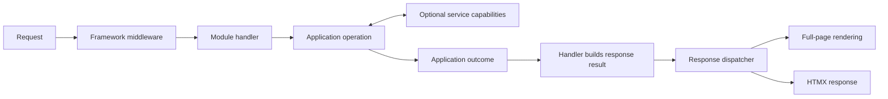

# HyperServer roadmap

## Purpose and status

HyperServer is an experimental Go framework for server-rendered web applications with first-class HTMX support. High performance, low overhead, and readable code are design goals that require measurement.

This document defines the intended architecture and implementation order. Planned capabilities are requirements, not claims about the current implementation. Treat the API as experimental and use `v0.x` releases while its contracts evolve.

### Current implementation

Snapshot updated September 28, 2026. Phase 0 is complete. Phase 1 is in progress.

[CI](.github/workflows/ci.yml) runs tests, vet, and full-suite race checks and passed at commit `7a26e27`. The latest mail-outcome changes passed these checks locally and await CI verification. These checks do not establish production readiness or replace a security audit. Performance remains unmeasured.

| Area | Current state | Remaining work |
| --- | --- | --- |
| Startup and modules | [Server construction](pkg/server/server.go) initializes database, sessions, and mail unconditionally. The [handler registry](pkg/handlers/handlers.go) stores instances globally. | Activate required services and create module instances per application. |
| Shutdown and TLS | [Startup](cmd/web/main.go) calls `ListenAndServe` regardless of TLS configuration. `ApplicationServer.Shutdown` is empty. | Implement explicit TLS/proxy configuration, shutdown, and resource cleanup. |
| Configuration and middleware | The [template](config/config-template.yaml) now uses `http.session.jwtKey`. Startup validates signing keys, lifetimes, and provider selections, with [regression tests](cmd/web/startup_test.go). [Auth middleware](pkg/services/middleware/auth.go) still has missing error returns and a reversed save-error condition. | Fix middleware error paths and test rejection behavior. |
| Forms and account writes | [Email-auth](auth/modules/email/email_auth.go) and [contact](modules/site/contact.go) handlers reject invalid forms. [User creation](pkg/services/user/user.go) is insert-only, and updates require an existing ID. [HTTP tests](cmd/web/http_test.go) cover competing registrations without password overwrites. | Complete the recovery and session safeguards below. |
| Recovery and verification | [Password-reset requests](auth/modules/email/email_auth.go) return a reset link to the requester. [Verification resend](auth/auth_manager.go) returns a verification link directly. Reset-token deletion follows the password update. | Deliver tokens to the account's email address and consume them atomically with the protected change. |
| Mail and sessions | [Mail](pkg/services/messaging/mail.go) has an injectable sender and returns `ErrMailUnavailable` when SMTP settings are incomplete. [SQLite logout](pkg/services/session/sqlitestore.go) only expires the browser cookie. | Bound SMTP operations, validate mail headers and HTML, and rotate and revoke sessions. |
| Exposure and redirects | The [reference application](cmd/web/main.go) is loopback-only. The development [site module](modules/site/router.go) owns diagnostic routes and requires POST for mail, logout, and session changes. [Redirects](pkg/util/redirect.go) still interpolate URLs into HTML and JavaScript. | Keep development modules out of production applications. Fix redirects and remaining auth route methods. Add CSRF protection and request limits. |
| Rendering and tests | The [HTTP harness](cmd/web/http_test.go) uses isolated databases, explicit configuration, and fake mail. Coverage now includes startup, configuration, auth, forms, mail, and sessions. [Rendering](pkg/components/content/content.go) still parses templates on each render. | Add coverage for the remaining security blockers and reuse parsed templates. |

## Design principles

- **Go's foundations.** Keep `http.Handler`, `http.Request`, `http.ResponseWriter`, `context.Context`, and standard middleware interoperable.
- **Standard library first.** Prefer Go's standard library when it meets requirements with clear, maintainable code. Accept narrower functionality when it improves readability, auditability, operation, and replacement.
- **Small core, composable services.** Keep rendering and HTMX response handling in the core. Activate authentication, sessions, persistence, caching, and mail through replaceable contracts when required.
- **Self-registering modules.** Imports register metadata. Each application owns dependency resolution, initialization, routes, and shutdown.
- **Progressive enhancement as a capability.** Support ordinary navigation and form submissions when an application requires them. Applications can depend on HTMX.
- **Explicit ownership.** Define framework and provider responsibilities without prescribing application structure or domain models.
- **Safe defaults and honest outcomes.** Validate required capabilities, surface failures, and make secure behavior the default.
- **Measured performance.** Require repeatable benchmarks or profiles before claiming an improvement.

Defer broad ORM features, a universal query language, speculative adapters, distributed caches, and a general job system until real requirements justify them.

### Dependency policy

Prefer the standard library when it does the job. A smaller feature set is acceptable if it keeps HyperServer easier to read and maintain.

An external package needs to earn its place. Check who maintains it, what dependencies it brings, and how much work replacing it would take. Those costs matter alongside the code it saves us.

Keeping dependencies down also limits exposure to supply-chain attacks. That preference does not justify writing our own cryptography or password hashing. Use established, maintained implementations for that work.

After the security fixes, reduce dependencies in this order. Replace the behavior HyperServer needs, not the full libraries.

| Dependency | Planned change |
| --- | --- |
| `go.uber.org/zap` | Use `log/slog` behind the logging contract. Verify output compatibility and measure performance. |
| `spf13/viper` | Use an explicit configuration loader with defaults, environment overrides, and validation. Retain a YAML parser if YAML remains the file format. Do not write a parser. |
| `go-playground/validator` | Use explicit form validation and field errors. Define email acceptance and test existing rules. Do not build another tag-driven validation engine. |
| `jmoiron/sqlx` | Evaluate `database/sql` during repository extraction. Prefer explicit queries and scanning where the added repetition is manageable. |

Keep `golang.org/x/crypto/bcrypt`, a maintained SQLite driver, and `golang-migrate` for now. Migration tooling can run separately during deployment. Keep `google/uuid` unless opaque identifiers meet the application's needs and the storage and compatibility costs justify changing formats.

Replace the archived JWT library as part of security work, not dependency cleanup. Separately evaluate whether server-side sessions and opaque recovery tokens remove the need for JWTs. Do not write a JWT implementation.

After each replacement, inspect the dependency graph to confirm what disappeared. An optional provider can still add module dependencies. Reduce maintenance and complexity, not just the number of entries in `go.mod`.

## Target user experience

A representative interaction follows this flow:

Application operations return outcomes independently of HTTP presentation. Handlers map those outcomes to response results. The dispatcher handles request classification, view selection, redirects, notifications, and HTMX response metadata.

The reference feature must demonstrate a form submission, validation errors that preserve input, persistence through a replaceable repository, and a successful fragment update or redirect. It must also demonstrate an ordinary form submission as an example of progressive enhancement.

## Intended architecture

### Core and service capabilities

The core provides server lifecycle, module composition, routing, middleware, configuration validation, rendering, response dispatch, error handling, and observability hooks. It must run without database, authentication, session, or mail services.

Providers supply sessions, authentication, caching, repositories, storage, and mail. Applications define authorization policy, which framework hooks enforce where required.

Form binding and input validation are transport helpers. Business validation belongs to application rules. Notifications are response or session data with rendering support.

The code using a cache decides what to cache, how long it can remain valid, and when to refresh or remove it. The cache implementation stores those copies, enforces expiration and size limits, and handles concurrent access. Callers decide how to recover from cache failures. The original data remains the source of truth.

The included site module exercises framework features in the local development application. It owns its diagnostic and sample routes. Production applications must not load development modules. Route inclusion follows module selection, not an application-wide development flag.

### Responsibility boundaries

Each part of HyperServer has a specific job when handling a request:

| Boundary | What it does |
| --- | --- |
| Transport | Reads the HTTP request, enforces request limits, and calls the matching handler. Writes the status, headers, cookies, and HTMX instructions. Keeps internal error details out of public responses. |
| Application integration | Lets a handler call application code, such as account registration, with the input it needs. The handler turns the returned value or error into a response. HyperServer does not require application code to know how that response is sent. |
| Persistence integration | Gives services access to operations such as finding a user or saving a session. The selected storage implementation performs the queries or file operations and handles concurrent writes. |
| Serialization | Encodes values into a format such as JSON and decodes them when read. The code using the serializer chooses the format and defines how older saved data stays readable. |
| Rendering | Runs the selected page or fragment template with its data and escapes values for HTML output. Returns the HTML body for transport to send. |

The application decides which changes must succeed together. For example, changing a password and consuming its reset token must form one transaction. The storage implementation commits both changes or rolls both back.

A handler's response result connects these parts. It identifies the view and data to render, along with response details such as a redirect or HTMX event.

### Self-registering modules

Modules register immutable descriptors through package `init()` functions. Registration performs no configuration loading, I/O, route binding, migration, or background work.

The process-wide **module catalog** describes available module types, factories, and required, optional, and provided capabilities. Each server snapshots the catalog into a **per-application registry** that owns enabled module instances and their runtime state. Tests can supply local catalogs.

Startup must:

1. Validate module names and select enabled modules.
2. Resolve required capabilities and explicitly select among competing providers.
3. Reject unresolved requirements, ambiguous selections, and dependency cycles.
4. Initialize modules in dependency order using typed dependencies or a resolver limited to declared capabilities.
5. Validate duplicate or conflicting route patterns and finish route registration before accepting traffic.

Multiple providers can advertise the same capability. Configuration selects a provider unless the consumer explicitly accepts several. A missing optional capability must have defined behavior.

On startup failure, close completed modules in reverse order. The failing factory must clean up resources it acquired before returning an error. Normal shutdown drains HTTP requests before closing dependent services in reverse order.

Descriptor and factory signatures remain design work. The contract must support independent server instances without an unrestricted service locator.

### Rendering and HTMX responses

A handler response result can describe full-page or fragment rendering, validation errors, redirects, notifications, out-of-band updates, client events, retargeting, and reswapping. Keep direct `http.Handler` use available for downloads, streaming, and specialized responses.

The response dispatcher owns HTTP and HTMX decisions. The renderer produces HTML. HTMX response headers are not processed on 3xx responses, so redirect handling must select the appropriate response behavior. [HTMX response documentation](https://htmx.org/docs/#response-headers)

Parse reusable template sets at startup or controlled development reload. Use `html/template` with trusted templates and escaped data. Restrict `template.HTML` to reviewed trust boundaries. [Go template documentation](https://pkg.go.dev/html/template)

## Storage and serialization

Replacement contracts must describe behavior consumers need. SQLite, PostgreSQL, MongoDB, local files, and cloud storage are candidate providers, not interchangeable guarantees.

### Data access contracts

Use narrow repositories for operations such as finding a user or creating an account. Framework services can use smaller key/value or blob contracts when those match their needs. Do not introduce a universal database or query API.

Specify missing-value errors, uniqueness, concurrency, expiration, and durability where the consumer depends on them. Express transactions or compare-and-swap as required capabilities when necessary. Reject unsupported guarantees instead of silently weakening them.

Applications can use backend clients directly. Framework contracts must not force all storage access through one abstraction.

Storage implementations must not dictate the serialization format. Services that store encoded values must allow the serializer to be replaced.

### Transactions and delivery

A provider must bind all repository operations participating in a transaction to the same transaction scope.

For registration and verification email, define recoverable state and a resend path. If durable asynchronous delivery is required, store the outbox record atomically with the account changes. Delivery retries require duplicate handling or idempotency. Do not promise exactly-once email delivery.

### Adapter validation

Start with in-memory test adapters and SQLite. Validate the same required behavior with PostgreSQL and one appropriate filesystem, document, or cloud-storage adapter. Run shared contract tests against each provider and document any additional guarantees. Add further adapters when applications need them.

## Caching and performance

Reuse parsed templates and immutable startup metadata first. These optimizations do not require a general cache service. Measure their effect before setting performance targets.

Provide an optional bounded in-memory cache and a no-op implementation for consumers that need caching. Introduce distributed caching only for a demonstrated deployment need.

Every cache integration must define:

- Source of truth, keys, tenant or user isolation, and freshness requirements.
- Expiration, invalidation triggers, and maximum memory or entry count.
- Concurrent misses, load failures, and behavior when the cache is unavailable.
- Hit, miss, eviction, and error measurements appropriate to the integration.

Rendered fragments, repository queries, and authorization data require explicit invalidation. HTTP caches must also distinguish full-page, fragment, and personalized responses where relevant.

Benchmark rendering, middleware, sessions, and representative requests with latency and allocation measurements. Record the workload and environment. Set regression budgets from stable baselines and profile before adding complexity.

## Delivery plan

The phases define implementation order. Security fixes can interrupt any phase. Keep basic CI active from Phase 1 and use the reference application to validate changes throughout.

### Phase 0: Record decisions (complete)

The roadmap defines the core and replaceable service boundaries. Public APIs are marked experimental. [Architecture decisions](docs/decisions/readme.md) record module-registration ownership and list unresolved contracts. Continue recording decisions as implementation resolves those contracts.

Exit when contributors can identify the core, service contracts, and unresolved API decisions.

### Phase 1: Correctness and security (in progress)

- Keep development modules out of production applications, fix middleware error paths, and validate configuration, including the session signing-key mapping.
- Replace interpolated redirects, enforce intended route methods, and add CSRF protection, request limits, safe cookies, security headers, and a documented CSP.
- Define TLS termination and trusted-proxy behavior. Add rate limits and generic account-recovery responses.
- Replace `dgrijalva/jwt-go`, whose upstream repository is archived. Validate the exact signing algorithm for JWT consumers. [Upstream archive](https://github.com/dgrijalva/jwt-go)
- Do not decode attacker-controlled input with gob. [Go gob security guidance](https://pkg.go.dev/encoding/gob#hdr-Security)
- Deliver reset and verification tokens to the account's email address. Do not return usable links to the requester. Consume tokens atomically with the protected change, including concurrent redemption tests.
- Make disabled mail and delivery failures explicit. Validate SMTP headers, bound delivery time, and make registration failures recoverable.
- Rotate sessions at login and privilege changes. Revoke server-side sessions on logout, test replay, and clean expired records.
- Add regression and HTTP integration tests for registration, verification, login, logout, reset, password change, and failure paths. Run tests and vet in CI.

Exit when these known blockers have regression coverage and the reference application's security controls work through HTTP tests. Passing this phase does not establish complete production readiness.

### Phase 2: Lifecycle and module composition

- Replace Zap with `log/slog`, then replace Viper with explicit configuration loading under the dependency policy.
- Implement the catalog and per-application registry with provider selection, dependency ordering, route validation, and declared dependency access.
- Return startup errors, validate required storage connectivity with deadlines, and remove shared mutable runtime state.
- Handle `SIGINT` and `SIGTERM`, drain requests, and close owned resources. Test startup rollback and shutdown deadlines.
- Use explicit filesystems or embedded assets for templates and migrations. Honor configured migration locations.

Exit when two independent servers can run in one process and tests cover partial startup, provider ambiguity, route conflicts, and cleanup.

### Phase 3: Rendering and reference workflow

- Replace tag-driven form validation with explicit validation and field errors.
- Implement response dispatch and reusable template sets.
- Build the representative form workflow with full-page and HTMX requests, inline errors, notifications, redirects, and out-of-band updates.
- Test escaping and response behavior against the supported HTMX version, including validation-error status handling.
- Establish rendering and middleware benchmarks. Publish a concise example of progressive enhancement.

Exit when the workflow uses shared response handling, passes HTTP tests, and has a reproducible benchmark baseline.

### Phase 4: Persistence and serialization contracts

- Extract repositories, required storage capabilities, and serializers from actual consumers.
- Evaluate replacing `sqlx` with `database/sql` inside the extracted repositories.
- Implement in-memory and SQLite adapters, then validate PostgreSQL and one suitable non-relational adapter.
- Test transaction scope, uniqueness, concurrency, format migration, and recoverable delivery where required.
- Document provider replacement and data migration.

Exit when a reference workflow passes the same contract and integration tests across different providers without changes to its handler or application operation.

### Phase 5: Caching and performance budgets

- Introduce cache implementations for demonstrated consumers and test isolation, resource bounds, invalidation, and failure behavior.
- Profile representative workloads and add miss coordination or fragment caching where measurements justify them.
- Set latency, allocation, memory, and build-size targets from measured baselines.

Exit when claimed improvements are reproducible and regression checks account for measurement noise.

### Phase 6: Deployment and recovery

- Add liveness, readiness, structured request and lifecycle logs, audit events, and optional metrics or tracing hooks.
- Include build metadata, dependency scanning, update automation, and repeatable release builds.
- Document TLS/proxy setup, secrets, migrations, backup, restore, and rollback or forward-repair procedures.
- Provide a container or service deployment and exercise load, dependency failure, restart, and soak tests.

Exit when a clean environment can deploy, operate, recover, and restore the reference application from documented procedures.

### Phase 7: Validate framework usability

Build a second application with different requirements and exercise a minimal stateless configuration. Use those applications to remove coupling, document extension contracts, and decide which APIs can stabilize.

Exit when multiple applications validate the core, unused services stay inactive, and compatibility and deprecation policies are explicit.
